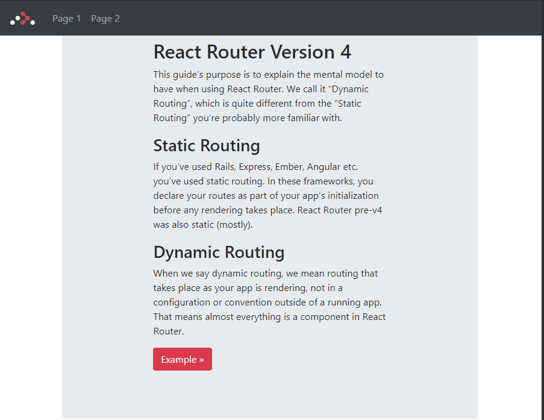
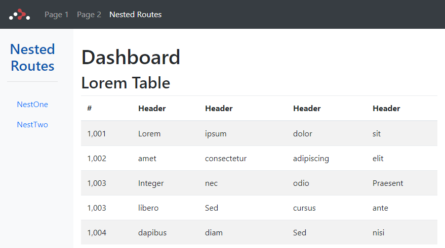

# A test project to get familiar with React Router v4





---
Table of Topics

01. [create-react-app](#01-create-react-app)
02. [react-bootstrap](#02-react-bootstrap)
03. [react-router-dom](#03-react-router-dom)
04. [Nested Routes](#04-nested-routes)
05. [Loading Animations](#05-loading-animations)


## 01 create-react-app

We use the [Facebook React Boilerplate](https://github.com/facebookincubator/create-react-app) to get started:

```
create-react-app react-router-4
```


## 02 react-bootstrap

And add some [Bootstrap](https://react-bootstrap.github.io/getting-started.html) for styling:

```
npm install --save react-bootstrap
```

We can now add the Bootsrap CSS inside the head of _./public/index.html_ :

```html
<link rel="stylesheet" href="https://maxcdn.bootstrapcdn.com/bootstrap/4.0.0-beta.2/css/bootstrap.min.css" integrity="sha384-PsH8R72JQ3SOdhVi3uxftmaW6Vc51MKb0q5P2rRUpPvrszuE4W1povHYgTpBfshb" crossorigin="anonymous">
```

And the Javascript at the end of the body tag:

```html
<script src="https://code.jquery.com/jquery-3.2.1.slim.min.js" integrity="sha384-KJ3o2DKtIkvYIK3UENzmM7KCkRr/rE9/Qpg6aAZGJwFDMVNA/GpGFF93hXpG5KkN" crossorigin="anonymous"></script>
<script src="https://cdnjs.cloudflare.com/ajax/libs/popper.js/1.12.3/umd/popper.min.js" integrity="sha384-vFJXuSJphROIrBnz7yo7oB41mKfc8JzQZiCq4NCceLEaO4IHwicKwpJf9c9IpFgh" crossorigin="anonymous"></script>
<script src="https://maxcdn.bootstrapcdn.com/bootstrap/4.0.0-beta.2/js/bootstrap.min.js" integrity="sha384-alpBpkh1PFOepccYVYDB4do5UnbKysX5WZXm3XxPqe5iKTfUKjNkCk9SaVuEZflJ" crossorigin="anonymous"></script>
```

To add a simple Navbar on top, we will now replace the default create-react-app JSX inside _./src/coponents/app.js_ with a Bootstrap Navbar from their [Example list](https://getbootstrap.com/docs/4.0/examples/) (remember to replace all instances of __class__ with __className__!):

```js
return (
  <div className="App">
    <nav className="navbar navbar-expand-md navbar-dark bg-dark fixed-top mb">
      <a className="navbar-brand" href="#">React Router 4</a>
      <button className="navbar-toggler" type="button" data-toggle="collapse" data-target="#navbarsExampleDefault" aria-controls="navbarsExampleDefault" aria-expanded="false" aria-label="Toggle navigation">
        <span className="navbar-toggler-icon"></span>
      </button>

      <div className="collapse navbar-collapse" id="navbarsExampleDefault">
        <ul className="navbar-nav mr-auto">
          <li className="nav-item active">
            <a className="nav-link" href="#">Page 1 <span className="sr-only">(current)</span></a>
          </li>
          <li className="nav-item">
            <a className="nav-link" href="#">Page 2</a>
          </li>
        </ul>
      </div>
    </nav>

    <div className="jumbotron mt">
      <div className="col-sm-8 mx-auto mt">
        <h1>This is just a Test</h1>
        <p>
          <a className="btn btn-primary" href="#" role="button">View navbar docs &raquo;</a>
        </p>
      </div>
    </div>

  </div>
);
```

Now start the app with:

```
npm start
```

The Bootstrap Navbar should now show up in our React app on _locallhost:3000_:


## 03 react-router-dom

We can now use the [basic example](https://reacttraining.com/react-router/web/example/basic) from the reacttraining.com website to add some routing to our app. First install the web based router - which is now called react-router-dom:

```
npm install --save react-router-dom
```

To add links to our navigation, we will need the [\<NavLink/\> component](https://reacttraining.com/react-router/web/api/NavLink), which is special version of the \<Link/\> that will add styling attributes to the rendered element when it matches the current URL (activeState). Replace all:

```html
<a href="#"></a>
```

with

```html
<NavLink to="#"></NavLink>
```

and import \<NavLink /\> from react-router-dom:

```js
import { NavLink } from 'react-router-dom'
```

We created two links to two components, aptly named _/page-1_ and _/page-2_, that we now have to create inside the _./src/components_ directory. For \<PageOne /\> we want to use an __ES6 Class Component__ to render some JSX:

```js
import React, {Component} from 'react'
import { Link } from 'react-router-dom'
import { Button } from 'react-bootstrap'

class PageOne extends Component {
  render() {
    return (
        <div className="jumbotron mt">
          [...]
        </div>
    );
  }
}

export default PageOne
```

And for \<PageTwo /\> we use a __Stateless Component__:

```js
import React from 'react'
import { Link } from 'react-router-dom'
import { Button } from 'react-bootstrap'


const PageTwo = () => (
    <div className="jumbotron mt">
      [...]
    </div>
)

export default PageTwo
```

Make sure to import all components in _./src/index.js_:

```js
import App from './App';
import PageOne from './PageOne';
import PageTwo from './PageTwo';
```

As well as adding the Router itself:

```js
import {
  BrowserRouter as Router,
  Route,
  Link
} from 'react-router-dom'
```

Now we can copy the navigation (everything inside the \<nav\> tag) from  _./src/components/app.js_ to _./src/index.js_ and replace the \<App /\> component that was placed there by create-react-app. Then wrap the JSX into a \<Router\> tag:

```js
render(
  <Router>
    <div className="container">
      <nav className="navbar navbar-expand-md navbar-dark bg-dark fixed-top mb">
        <NavLink className="navbar-brand" to="/">  </NavLink>

        <button className="navbar-toggler" type="button" data-toggle="collapse" data-target="#navbarsExampleDefault" aria-controls="navbarsExampleDefault" aria-expanded="false" aria-label="Toggle navigation">
          <span className="navbar-toggler-icon"></span>
        </button>

        <div className="collapse navbar-collapse">
          <ul className="navbar-nav mr-auto">
            <li className="nav-item">
              <NavLink className="nav-link" to="/page-1">Page 1</NavLink>
            </li>
            <li className="nav-item">
              <NavLink className="nav-link" to="/page-2">Page 2</NavLink>
            </li>
          </ul>
        </div>
      </nav>

      <Route exact path="/" component={App}/>
      <Route path="/page-1" component={PageOne}/>
      <Route path="/page-2" component={PageTwo}/>
    </div>
  </Router>,

document.getElementById('root'))
```


## 04 Nested Routes

To create nested routes in React Router v4, we just have to add more routes inside a component. E.g. you have a route that leads the user from _/_ to _/chapter1_, rendering the \<Chapter1 /\> component. To create a route to a nested article inside the chapter, like _/chapter1/subarticle1_, we now have to add further routes with the __${match.url}__ attribute inside the \<Chapter1 /\>:

```js
<NavLink to={`${match.url}/subarticle1`} />
<Route path={`${match.url}/subarticle1`} component={SubArticle1}/>
```

So lets add another Link and Route to the Nav component in _./src/index.js_ to render another component, called \<NestedRoutes /\>, under _/nested-routes_. This is going to be our parent component for two nested routes/components: \<PageOneNested /\> and \<PageTwoNested /\> rendered under _./nested-routes/page-1-nested_ and _./nested-routes/page-2-nested_, respectively.


```js
import React from 'react'
import { Route, NavLink, Link } from 'react-router-dom'

import PageOneNested from './PageOneNested'
import PageTwoNested from './PageTwoNested'

const Topics = ({ match }) => (

    <div className="container-fluid">
      <div className="row">
        <nav className="nav nav-pills nav-fill col-sm-3 col-md-2 d-none d-sm-block bg-light sidebar">
          <div className="clearfix"><br/><br/><br/></div>
          <Link className="nav-item nav-link" to={match.url}>
            <h3>Nested Routes</h3>
            <hr/>
          </Link>
          <NavLink className="nav-item nav-link" to={`${match.url}/page-1-nested`}>
            NestOne
          </NavLink>
          <NavLink className="nav-item nav-link" to={`${match.url}/page-2-nested`}>
            NestTwo
          </NavLink>
        </nav>

        <main role="main" className="col-sm-9 ml-sm-auto col-md-10 pt-3">
          <div className="clearfix"><br/><br/><br/></div>
          <h1>Dashboard</h1>
          <Route path={`${match.url}/page-1-nested`} component={PageOneNested}/>
          <Route path={`${match.url}/page-2-nested`} component={PageTwoNested}/>
          <Route exact path={match.url} render={() => (
            <div>
              [...]
            </div>
          )}/>
        </main>
      </div>
    </div>
)

export default Topics
```

You can create the two files PageOneNested.js and PageTwoNested.js inside _./src/components_. Just copy and paste the content from PageOne.js or PageTwo.js and change the component names, inside the file to PageOneNested and PageTwoNested.





Clicking on the NestOne or NestTwo link will load the components \<PageOneNested /\> or \<PageTwoNested /\> in the \<main\> area of the screen, under the Dashboard title - awesome !


## 05 Loading Animations

The [react-transition-group](https://github.com/reactjs/react-transition-group/tree/v1-stable) is an easy way to perform animations when a React component enters or leaves the DOM.


```
npm install react-transition-group --save
```

https://hackernoon.com/animated-page-transitions-with-react-router-4-reacttransitiongroup-and-animated-1ca17bd97a1a
https://medium.com/appifycanada/animations-with-reacttransitiongroup-4972ad7da286
https://github.com/reactjs/react-transition-group/tree/v1-stable


.
